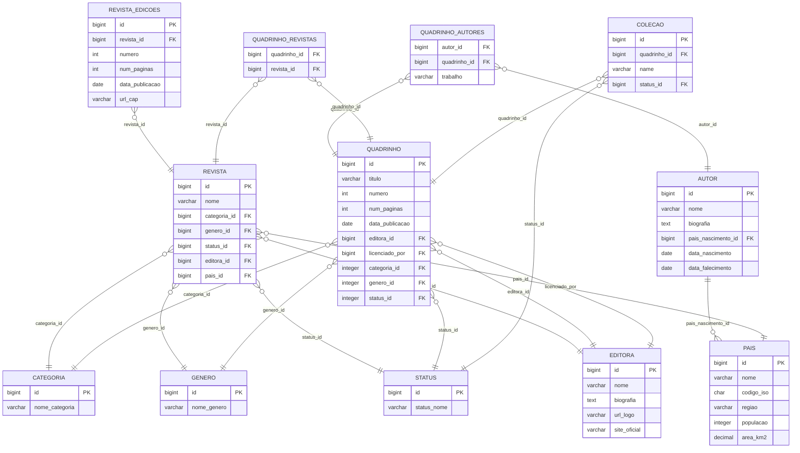

# A Hierarquia de cadastro do catalogo

1. Pais
2. Autor
3. Editora
4. Categoria
5. Genero
6. Status
7. Revista
8. revista_edicoes 
9. Quadrinho
10. Quadrinho Autor
10. Quadrinho Revista

```mermaid
erDiagram
  PAIS {
    bigint id PK
    varchar nome
    char codigo_iso
    varchar regiao
    integer populacao
    decimal area_km2
  }
  AUTOR {
    bigint id PK
    varchar nome
    text biografia
    bigint pais_nascimento_id FK
    date data_nascimento
    date data_falecimento
  }
  EDITORA {
    bigint id PK
    varchar nome
    text biografia
    varchar url_logo
    varchar site_oficial
  }
  CATEGORIA {
    bigint id PK
    varchar nome_categoria
  }
  GENERO {
    bigint id PK
    varchar nome_genero
  }
  STATUS {
    bigint id PK
    varchar status_nome
  }
  REVISTA {
    bigint id PK
    varchar nome
    bigint categoria_id FK
    bigint genero_id FK
    bigint status_id FK
    bigint editora_id FK
    bigint pais_id FK
  }
  REVISTA_EDICOES {
    bigint id PK
    bigint revista_id FK
    int numero
    int num_paginas
    date data_publicacao
    varchar url_cap
  }
  QUADRINHO {
    bigint id PK
    varchar titulo
    int numero
    int num_paginas
    date data_publicacao
    bigint editora_id FK
    bigint licenciado_por FK
    integer categoria_id FK
    integer genero_id FK
    integer status_id FK
  }
  QUADRINHO_AUTORES {
    bigint autor_id FK
    bigint quadrinho_id FK
    varchar trabalho
  }
  QUADRINHO_REVISTAS {
    bigint quadrinho_id FK
    bigint revista_id FK
  }
  COLECAO {
    bigint id PK
    bigint quadrinho_id FK
    varchar name
    bigint status_id FK
  }

  AUTOR ||--o{ PAIS : "pais_nascimento_id"
  REVISTA }o--|| CATEGORIA : "categoria_id"
  REVISTA }o--|| GENERO : "genero_id"
  REVISTA }o--|| STATUS : "status_id"
  REVISTA }o--|| EDITORA : "editora_id"
  REVISTA }o--|| PAIS : "pais_id"
  REVISTA_EDICOES }o--|| REVISTA : "revista_id"
  QUADRINHO_AUTORES }o--|| AUTOR : "autor_id"
  QUADRINHO_AUTORES }o--|| QUADRINHO : "quadrinho_id"
  QUADRINHO }o--|| EDITORA : "editora_id"
  QUADRINHO }o--|| EDITORA : "licenciado_por"
  QUADRINHO }o--|| CATEGORIA : "categoria_id"
  QUADRINHO }o--|| GENERO : "genero_id"
  QUADRINHO }o--|| STATUS : "status_id"
  QUADRINHO_REVISTAS }o--|| QUADRINHO : "quadrinho_id"
  QUADRINHO_REVISTAS }o--|| REVISTA : "revista_id"
  COLECAO }o--|| QUADRINHO : "quadrinho_id"
  COLECAO }o--|| STATUS : "status_id"
```

